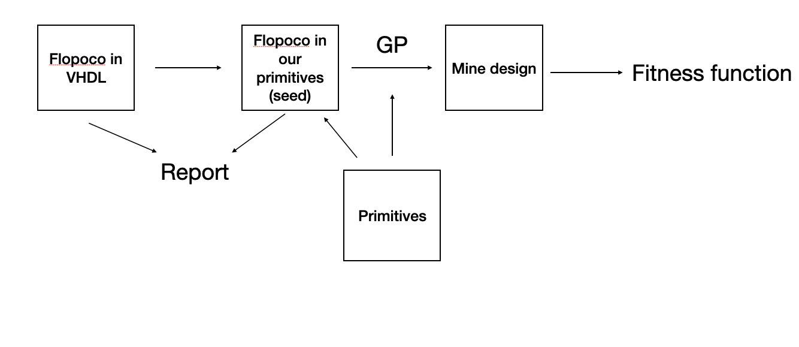

# Generic Programming for Approximation

## Pipeline



**Main flow:**

[FloPoCo's VHDL](#flopocos-vhdl) → [Translating FloPoCo into our primitives (seed)](#translating-flopoco-into-our-primitives-seed) → [Search](#Search) → [Fitness Function](#fitness-function) → [Search Results](#search-results)

**Feeds into the flow:**

- [FloPoCo's VHDL](#flopocos-vhdl) and [Translating FloPoCo into our primitives (seed)](#translating-flopoco-into-our-primitives-seed) both produce → [Report](#report)
- [Primitives](#primitives) make up the seed, and also make up GP's search results

---

## FloPoCo's VHDL


## Translating FloPoCo into our primitives (seed)

```python
from deap import gp
from benchmarks.minifloat_hardware import make_pset, make_exact_seed_str

SRC = (4, 3)
OUT = (4, 4)
pset = make_pset(SRC, OUT)
seed_str = make_exact_seed_str(SRC, OUT, pset=pset, with_exceptions=True)
tree = gp.PrimitiveTree.from_string(seed_str, pset)
func = gp.compile(tree, pset)
```

```python
from synth.minifloat_synth import gp_to_verilog

verilog = gp_to_verilog(tree, SRC, OUT, module_name='top')
```

```python
for a in range(1 << (SRC[0] + SRC[1] + 1)):
    for b in range(1 << (SRC[0] + SRC[1] + 1)):
        out = int(func(a, b))
```

### InputIEEE (called once per operand: `input_ieee_e{e}m{m}(ma)` / `(mb)`)

| FloPoCo VHDL | `_make_input_ieee` (benchmarks/minifloat_hardware.py) |
|---|---|
| `expX <= X(6 downto 3);` | `expf = (bits >> m) & exp_mask` |
| `fracX <= X(2 downto 0);` | `frac = bits & frac_mask` |
| `sX <= X(7);` | `sign = (bits >> (e + m)) & 1` |
| `expZero <= '1' when expX = "0000" else '0';` | `exp_zero = expf == 0` |
| `expInfty <= '1' when expX = "1111" else '0';` | `exp_infty = expf == exp_mask` |
| `fracZero <= '1' when fracX = "000" else '0';` | `frac_zero = frac == 0` |
| `reprSubNormal <= fracX(2);` | `repr_subnormal = bool(frac & top_bit_mask)` |
| `sfracX <= fracX(1 downto 0)&'0' when (expZero='1' and reprSubNormal='1') else fracX;` | `sfrac = ((frac & (top_bit_mask-1))<<1)&frac_mask if exp_zero and repr_subnormal else frac` |
| `infinity <= expInfty and fracZero;` | `infinity = exp_infty and frac_zero` |
| `zero <= expZero and not reprSubNormal;` | `zero = exp_zero and not repr_subnormal` |
| `NaN <= expInfty and not fracZero;` | `nan = exp_infty and not frac_zero` |
| `exnR <= "00" when zero='1' else "10" when infinity='1' else "11" when NaN='1' else "01";` | `exn = 0 if zero else 2 if infinity else 3 if nan else 1` |
| `R <= exnR & sX & expR & fracR;` | `return (exn<<in_width) \| (sign<<(e+m)) \| (expf<<m) \| sfrac` |

### FPMult (`make_exact_seed_str`)

| FloPoCo VHDL | Expression in our seed string |
|---|---|
| `sign <= X(7) xor Y(7);` | `sign_out = xor_sign(sign_a, sign_b)`|
| `expX <= X(6:3); expY <= Y(6:3);` | `expf_a_expr`/`expf_b_expr = uhigh_{e+m}_{e}(exp_frac_a/b)` |
| `expSumPreSub <= ("00"&expX) + ("00"&expY);` | `expf_a_wide/b_wide = ucast(expf_a/b_expr, e, w_fixed)`; `exp_sum_full = uadd_{w_fixed}_{w_fixed}(...)`; `exp_sum_wide = ulow(...)` |
| `bias <= 7; expSum <= expSumPreSub - bias;` | `exp_after_bias = usubwrap_{w_fixed}_{w_fixed}(exp_sum_wide, bias_tag)`, `bias_tag = 7`|
| `sigX <= "1"&X(2:0); sigY <= "1"&Y(2:0);` | `sig_a/b = uconcat_1_{m}(uone_1, frac_adj_a/b)` |
| `SignificandMultiplication: IntMultiplier port map(X=>sigX,Y=>sigY,R=>sigProd);` | `raw = sigmul_{m+1}_{m+1}(sig_a, sig_b)` |
| `excSel <= X(9:8)&Y(9:8); with excSel select exc <= ...;` | `exc_sel = uconcat_2_2(tag_a, tag_b)`; `exc = exc_lookup(exc_sel)` |
| `norm <= sigProd(7);` | `carry = msb_u{raw_w}(raw)` |
| `expPostNorm <= expSum + ("00000"&norm);` | `exp_post_norm_wide = uadd_{w_fixed}_1(exp_after_bias, carry_u1)`; truncated with `ulow` |
| `sigProdExt <= sigProd(6:0)&'0' when norm='1' else sigProd(5:0)&"00";` | `sig_prod_ext = ite_u{raw_w}(carry, carry1_view, carry0_view)` |
| `expSig <= expPostNorm & sigProdExt(7:4);` | `combined = uconcat_{w_fixed}_{mo}(exp_post_norm, kept)` |
| `sticky<=sigProdExt(3); guard<=(sigProdExt(2:0)!=0); round<=sticky and (...);` | `guard = msb_u{shift}(discarded)`; `sticky_nonzero = ugt_u{shift-1}(...)`; `round_inc = _and_sign(guard, _or_sign(...))` |
| `RoundingAdder: IntAdder port map(Cin=>round, X=>expSig, Y=>zeros, R=>expSigPostRound);` | `combined_rounded = roundadd_{combined_w}_{combined_w}(combined, zero_pad_tag, round_inc)` |
| `with expSigPostRound(9:8) select excPostNorm <= "01" when "00", "10" when "01", "00" when "11"\|"10", "11" when others;` | `top2 = uhigh_{combined_w}_2(combined_rounded)`; `excpostnorm = excpostnorm_lookup(top2)` |
| `with exc select finalExc <= exc when "11"\|"10"\|"00", excPostNorm when others;` | `is_tags_normal = ueq(exc, 1)`; `final_exc_tag = ite_u2(is_tags_normal, excpostnorm, exc)` |
| `R <= finalExc & sign & expSigPostRound(7:0);` | `_pack_then_unpack_R`|

### OutputIEEE (`output_ieee_e{eo}m{mo}(final_exc_tag, sign_out, exp_narrow, frac_final)`)

| FloPoCo VHDL | `_make_output_ieee` (benchmarks/minifloat_hardware.py) |
|---|---|
| `fracX<=X(3:0); exnX<=X(10:9); expX<=X(7:4); sX<=X(8);` | Passed directly as 4 independent arguments: `frac`, `exn`, `expf`, `sign`|
| `sX <= X(8) when (exnX="01" or "10" or "00") else '0';` | `out_sign = sign if exn in (0, 1, 2) else 0` |
| `expZero <= '1' when expX="0000" else '0';` | `exp_zero = (expf == 0)` |
| `fracR <= "0000" when exnX="00" else '1'&fracX(3:1) when (expZero='1' and exnX="01") else fracX when exnX="01" else "000"&exnX(0);` | `frac_r`: `0` when `exn==0`; `(1<<(mo-1)) \| (frac>>1)` when `exp_zero and exn==1`|
| `expR <= "0000" when exnX="00" else expX when exnX="01" else "1111";` | `exp_r`: `0` when `exn==0`; `expf` when `exn==1`; otherwise `exp_mask` |
| `R <= sX & expR & fracR;` | `return (out_sign<<(eo+mo)) \| (exp_r<<mo) \| frac_r` |

## Report

**E4M3×E4M3→E4M4 **: both sides come out to **262 cells in yosys**

```
        FloPoCo   Ours
cells:    262      262
$_ANDNOT_  69       69
$_AND_     16       16
$_MUX_     16       16
$_NAND_    24       24
$_NOR_     23       23
$_NOT_      4        4
$_ORNOT_   10       10
$_OR_      44       44
$_XNOR_    25       25
$_XOR_     31       31
```

## Primitives

**Generic bit-level operators** 

| primitive | signature |
|---|---|
| `uadd_x_y` | `UInt(x),UInt(y) → UInt(max(x,y)+1)` | 
| `usubwrap_x_y` | `UInt(x),UInt(y) → UInt(max(x,y)+1)` |
| `sigmul_x_y` | same as `umul_x_y` | 
| `roundadd_x_y` | `UInt(x),UInt(y),Sign → UInt(max(x,y))` | 
| `uconcat_x_y` | `UInt(x),UInt(y) → UInt(x+y)` | 
| `uhigh_x_y` | `UInt(x) → UInt(y)` (`y<x`) | 
| `ulow_x_y` | `UInt(x) → UInt(y)` (`y<x`) | 
| `ucast_x_y` | `UInt(x) → UInt(y)` (`x≠y`) | 
| `ulshift_x_byN` | `UInt(x) → UInt(x+N)` | 
| `msb_ux` | `UInt(x) → Sign` | 
| `ugt_ux` | `UInt(x),UInt(x) → Sign` | 
| `ite_ux` | `Sign,UInt(x),UInt(x) → UInt(x)` |
| `uzero_x`/`uone_x` | constant `UInt(x)` | 

**Primitives that give GP a larger search space**

| primitive | signature | 
|---|---|
| `ushr_x_y` | `UInt(x),UInt(y) → UInt(x)` | 
| `ushl_x_y` | `UInt(x),UInt(y) → UInt(x)` | 
| `sticky_x_y` | `UInt(x),UInt(y) → Sign` | 
| `lzc_ux` | `UInt(x) → UInt(lzc_out_w)` | 
| `orbit_ux` | `UInt(x),Sign → UInt(x)` | 
| `unot_x` | `UInt(x) → UInt(x)` | 

**Sign-related operators**

| primitive | signature | 
|---|---|
| `xor_sign` | `Sign,Sign → Sign` | 
| `ite_sign` | `Sign,Sign,Sign → Sign` | 
| `bit_to_u1` | `Sign → UInt(1)` | 
| `positive_sign`/`negative_sign` | 

**Format-specific composite primitives** (`e`/`m` is the input format, `eo`/`mo` is the output format)

| primitive | 
|---|
| `sign_e{e}m{m}` | 
| `expf_e{e}m{m}` | 
| `sig_e{e}m{m}` | 
| `classify_e{e}m{m}` | 
| `input_ieee_e{e}m{m}` | 
| `output_ieee_e{eo}m{mo}` | 
| `encode_e{eo}m{mo}` | 

**Lookup-table primitives** (correspond to FloPoCo's `with...select`)

| primitive |
|---|
| `exc_lookup` | 
| `excpostnorm_lookup` | 

## Search
```python
def run_gp_ulp(threshold, pset, data, src_format, out_format, seed_area, seed_str, ngen, pop_size,
              extra_seed_strs=(), archive_size=5, tournsize=2, cxpb=0.5, mutpb=0.5,
              reinject_interval=5):#archive_size:how many hall_of_fame(the best result or seed)we insert to our search every time; tournsize: we pick the best from how many results; cxpb & mutpb: evaluate & variation probability
    seed_tree = gp.PrimitiveTree.from_string(seed_str, pset)
    max_h = max(20, seed_tree.height + 2)

    toolbox = base.Toolbox()
    toolbox.register("expr", gp.genHalfAndHalf, pset=pset, min_=1, max_=3)
    toolbox.register("individual", tools.initIterate, creator.Individual, toolbox.expr)
    toolbox.register("population", tools.initRepeat, list, toolbox.individual)
    toolbox.register("select", tools.selTournament, tournsize=tournsize)
    toolbox.register("mate", gp.cxOnePoint)
    toolbox.register("mutate", gp.mutUniform, expr=toolbox.expr, pset=pset)
    toolbox.decorate("mate", gp.staticLimit(key=attrgetter("height"), max_value=max_h))
    toolbox.decorate("mutate", gp.staticLimit(key=attrgetter("height"), max_value=max_h))
    toolbox.register("evaluate", make_evaluate_ulp(threshold, pset, data, src_format, out_format, seed_area))

    pop = []
    attempts = 0
    while len(pop) < pop_size and attempts < pop_size * 5:
        try:
            pop.append(toolbox.individual())
        except Exception:
            pass
        attempts += 1
    if not pop:
        pop = [creator.Individual(gp.PrimitiveTree.from_string(seed_str, pset)) for _ in range(pop_size)]

    reinject_strs = [seed_str] + list(extra_seed_strs)
    reinject_inds = []
    for s in reinject_strs:
        try:
            ind = creator.Individual(gp.PrimitiveTree.from_string(s, pset))
        except Exception:
            continue
        ind.fitness.values = toolbox.evaluate(ind)
        reinject_inds.append(ind)

    archive = tools.HallOfFame(archive_size)
    archive.update(pop)
    for gen in range(ngen):
        offspring = toolbox.select(pop, len(pop))
        offspring = list(map(toolbox.clone, offspring))
        offspring = algorithms.varAnd(offspring, toolbox, cxpb=cxpb, mutpb=mutpb)

        if gen % reinject_interval == 0:#we insert back the seed and the best result got so far every reinject_interval generation, in case all of our finally result is similar to the seed
            slot = 0
            for ind in reinject_inds:
                if slot >= len(offspring):
                    break
                offspring[slot] = toolbox.clone(ind)
                slot += 1
            for ind in archive:
                if slot >= len(offspring):
                    break
                offspring[slot] = toolbox.clone(ind)
                slot += 1

        for ind in offspring:
            if not ind.fitness.valid:
                ind.fitness.values = toolbox.evaluate(ind)

        archive.update(offspring)
        pop[:] = offspring

    return archive[0]
```

I made 2 seeds: the FloPoCo-structural one and one using our new primitves(not design to corresponds to Flopoco)  insert the 2 seeds into the population every a number of generations:

```python
from benchmarks.minifloat_hardware import make_pset, make_exact_seed_str, make_shift_add_seed_str

pset = make_pset(SRC, OUT)
seed_str = make_exact_seed_str(SRC, OUT, pset=pset, with_exceptions=True)
shift_add_str = make_shift_add_seed_str(SRC, OUT, pset=pset, with_exceptions=True)

best = run_gp_ulp(threshold, pset, data, SRC, OUT, seed_area, seed_str, ngen=50, pop_size=100,
                  extra_seed_strs=(shift_add_str,),
                  archive_size=5, tournsize=2, cxpb=0.2, mutpb=0.6, reinject_interval=5)
```

## Search Results

E4M3×E4M3→E4M4, `threshold=1`, CVC5-verified unless noted:

| Config | Area | Verified | Notes |
|---|---|---|---|
| Seed (FloPoCo-structural) | 262 | — | baseline |
| Old params (archive_size=20, tournsize=3, cxpb=0.5, mutpb=0.3) | 261 | Yes | same result at threshold=1/2/4 |
| New params + expanded pset (`lzc_u`/`ushr_`/`ushl_`/`sticky_`/`orbit_u`/`unot_` added) | 258 | Yes | new primitives appear in the result, but not exploited for their dynamic behavior |

**What changed vs. the seed** (tuned-params: 262 to 258):

1. **A 1976-node block collapsed to 2 nodes.** A part of the seed repeatedly recomputes `input_ieee_e4m3(ma/mb)` decoding and `sigmul_4_4` significand multiplication — duplicated because a GP tree can't share subexpressions, so the same computation gets re-expanded wherever it's referenced. GP replaced this entire block with `ucast_10_3(uone_10)`, a constant expression that doesn't depend on `ma`/`mb` at all — verified by CVC5 to be equivalent across the whole input domain, meaning this block's result never actually reached the output.

2. **Reused an existing lookup table instead of recomputing.** The seed computes `uconcat_1_8(bit_to_u1(xor_sign(msb_u8(...ARG0), msb_u8(...ARG1))), uconcat_4_4(...))`; GP replaced it with `excpostnorm_lookup(uhigh_10_2(...))`. `excpostnorm_lookup` is originally there to look up FPMult's post-rounding normalization table — GP repurposed it here to produce the same result through a different mechanism, not just by folding to a constant.


## Verification

```python
def verify_mult_ulp_bound(individual, src_format, out_format, ulp_threshold,
                          timeout_ms=TIMEOUT_MS,
                          ma_range=None, mb_range=None):
    #generate some basic setup:bitwidth, exponent&mantissa value
    e, m = src_format
    eo, mo = out_format
    in_width = e + m + 1
    out_sig = mo + 1

    try:
        solver = cvc5.Solver()
        solver.setLogic("ALL")
        solver.setOption("fp-exp", "true")
        solver.setOption("produce-models", "true")
        solver.setOption("tlimit-per", str(timeout_ms))

        ma_bv = solver.mkConst(solver.mkBitVectorSort(in_width), 'ma')
        mb_bv = solver.mkConst(solver.mkBitVectorSort(in_width), 'mb')#setup ma&mb as two unknown bitvector

        ma_exp = solver.mkTerm(solver.mkOp(Kind.BITVECTOR_EXTRACT, in_width - 2, m), ma_bv)#get the exponent and mantissa 
        mb_exp = solver.mkTerm(solver.mkOp(Kind.BITVECTOR_EXTRACT, in_width - 2, m), mb_bv)
        ma_frac = solver.mkTerm(solver.mkOp(Kind.BITVECTOR_EXTRACT, m - 1, 0), ma_bv)
        mb_frac = solver.mkTerm(solver.mkOp(Kind.BITVECTOR_EXTRACT, m - 1, 0), mb_bv)
        ma_exp_zero = solver.mkTerm(Kind.EQUAL, ma_exp, solver.mkBitVector(e, 0))
        mb_exp_zero = solver.mkTerm(Kind.EQUAL, mb_exp, solver.mkBitVector(e, 0))#decide if the exponent is all 0
        ma_top_frac_bit = solver.mkTerm(solver.mkOp(Kind.BITVECTOR_EXTRACT, m - 1, m - 1), ma_frac)
        mb_top_frac_bit = solver.mkTerm(solver.mkOp(Kind.BITVECTOR_EXTRACT, m - 1, m - 1), mb_frac)#get the firstt bit of mantissa
        ma_top_frac_zero = solver.mkTerm(Kind.EQUAL, ma_top_frac_bit, solver.mkBitVector(1, 0))
        mb_top_frac_zero = solver.mkTerm(Kind.EQUAL, mb_top_frac_bit, solver.mkBitVector(1, 0))#decide if it's 0
        ma_is_flush_zero = solver.mkTerm(Kind.AND, ma_exp_zero, ma_top_frac_zero)
        mb_is_flush_zero = solver.mkTerm(Kind.AND, mb_exp_zero, mb_top_frac_zero)#if the expoent and the first bit of mantissa is all 0 then flush the number to 0
        either_flush_zero = solver.mkTerm(Kind.OR, ma_is_flush_zero, mb_is_flush_zero)#if one is 0, then product is 0
        solver.assertFormula(solver.mkTerm(Kind.DISTINCT, ma_exp, solver.mkBitVector(e, (1 << e) - 1)))
        solver.assertFormula(solver.mkTerm(Kind.DISTINCT, mb_exp, solver.mkBitVector(e, (1 << e) - 1)))#the exponent cant be all 1 either

        rm = solver.mkRoundingMode(_RM)
        ma_dbl = widen(solver, decode_native(solver, ma_bv, e, m), _DBL_E, _DBL_M)
        mb_dbl = widen(solver, decode_native(solver, mb_bv, e, m), _DBL_E, _DBL_M)#transfer the value to a larger floating point format to avoid overflow
        _assert_input_range(solver, ma_dbl, ma_range, rm, _DBL_E, _DBL_M)
        _assert_input_range(solver, mb_dbl, mb_range, rm, _DBL_E, _DBL_M)
        exact_dbl = solver.mkTerm(Kind.FLOATINGPOINT_MULT, rm, ma_dbl, mb_dbl)#get the exact product
        exact_finite = solver.mkTerm(Kind.NOT, solver.mkTerm(Kind.OR,
            solver.mkTerm(Kind.FLOATINGPOINT_IS_INF, exact_dbl),
            solver.mkTerm(Kind.FLOATINGPOINT_IS_NAN, exact_dbl)))
        solver.assertFormula(exact_finite)#if the product is not abnormal, store it

        from benchmarks.minifloat import _bias
        min_normal_val = 2.0 ** (1 - _bias(eo))#the smallest number can be represented
        min_normal_dbl = solver.mkTerm(solver.mkOp(Kind.FLOATINGPOINT_TO_FP_FROM_REAL, _DBL_E, _DBL_M + 1),
                                       rm, _mkReal_exact(solver, min_normal_val))#exact product to floating number
        exact_abs_dbl = solver.mkTerm(Kind.FLOATINGPOINT_ABS, exact_dbl)
        is_underflow = solver.mkTerm(Kind.FLOATINGPOINT_LT, exact_abs_dbl, min_normal_dbl)
        is_neg = solver.mkTerm(Kind.FLOATINGPOINT_IS_NEG, exact_dbl)#decide if there's underflow and if the product is negative

        zero_pos = solver.mkTerm(solver.mkOp(Kind.FLOATINGPOINT_TO_FP_FROM_REAL, eo, out_sig), rm, solver.mkReal(0))
        zero_neg = solver.mkTerm(Kind.FLOATINGPOINT_NEG, zero_pos)
        min_normal_pos = solver.mkTerm(solver.mkOp(Kind.FLOATINGPOINT_TO_FP_FROM_REAL, eo, out_sig),
                                       rm, _mkReal_exact(solver, min_normal_val))
        min_normal_neg = solver.mkTerm(Kind.FLOATINGPOINT_NEG, min_normal_pos)
        zero_signed = solver.mkTerm(Kind.ITE, is_neg, zero_neg, zero_pos)
        min_normal_signed = solver.mkTerm(Kind.ITE, is_neg, min_normal_neg, min_normal_pos)#decide if, the leading bit is 1 the negative, otherwise positive

        nudge = solver.mkTerm(Kind.FLOATINGPOINT_MULT, rm, exact_abs_dbl,
                              solver.mkTerm(solver.mkOp(Kind.FLOATINGPOINT_TO_FP_FROM_REAL, _DBL_E, _DBL_M + 1),
                                           rm, _mkReal_exact(solver, 2.0 ** -40)))
        exact_for_ceil = solver.mkTerm(Kind.FLOATINGPOINT_ADD, rm, exact_dbl, nudge)
        exact_for_floor = solver.mkTerm(Kind.FLOATINGPOINT_SUB, rm, exact_dbl, nudge)#the nudge is create to avoid exact integer like 15, if there's integer , the ceil and floor will be the same, so we need to add a small number to make sure they are different

        ceil_native = solver.mkTerm(solver.mkOp(Kind.FLOATINGPOINT_TO_FP_FROM_FP, eo, out_sig),
                                    solver.mkRoundingMode(RoundingMode.ROUND_TOWARD_POSITIVE), exact_for_ceil)
        floor_native = solver.mkTerm(solver.mkOp(Kind.FLOATINGPOINT_TO_FP_FROM_FP, eo, out_sig),
                                     solver.mkRoundingMode(RoundingMode.ROUND_TOWARD_NEGATIVE), exact_for_floor)#using the round_towards func to get the ceil and floor value of the product

        candidate_lo = solver.mkTerm(Kind.ITE, either_flush_zero, zero_signed,
                                     solver.mkTerm(Kind.ITE, is_underflow, zero_signed, floor_native))
        candidate_hi = solver.mkTerm(Kind.ITE, either_flush_zero, zero_signed,
                                     solver.mkTerm(Kind.ITE, is_underflow, min_normal_signed, ceil_native))#both candidate_lo and candidate_hi are the two nearest floating point number to the exact product, if the product is underflow, then the lower bound is 0, and the upper bound is the smallest normal number

        lo_dbl = solver.mkTerm(solver.mkOp(Kind.FLOATINGPOINT_TO_FP_FROM_FP, _DBL_E, _DBL_M + 1), rm, candidate_lo)
        hi_dbl = solver.mkTerm(solver.mkOp(Kind.FLOATINGPOINT_TO_FP_FROM_FP, _DBL_E, _DBL_M + 1), rm, candidate_hi)
        dist_lo = solver.mkTerm(Kind.FLOATINGPOINT_ABS, solver.mkTerm(Kind.FLOATINGPOINT_SUB, rm, exact_dbl, lo_dbl))
        dist_hi = solver.mkTerm(Kind.FLOATINGPOINT_ABS, solver.mkTerm(Kind.FLOATINGPOINT_SUB, rm, exact_dbl, hi_dbl))#get the absolue value of the difference between the exact product and the two nearest floating point number
        lo_is_nearer = solver.mkTerm(Kind.FLOATINGPOINT_LT, dist_lo, dist_hi)
        round_nearest_dbl = solver.mkTerm(Kind.ITE, lo_is_nearer, lo_dbl, hi_dbl)#see which line it's nearer to

        ulp_size_dbl = solver.mkTerm(Kind.FLOATINGPOINT_ABS,
                                     solver.mkTerm(Kind.FLOATINGPOINT_SUB, rm, hi_dbl, lo_dbl))#get how big 1 ulp is

        candidate_bv = gp_to_cvc5(individual, ma_bv, mb_bv, solver, src_format=src_format)#get the real gp expression output
        approx = decode_native_satmax(solver, candidate_bv, eo, mo)#candidate output to floating point number
        approx_dbl = solver.mkTerm(solver.mkOp(Kind.FLOATINGPOINT_TO_FP_FROM_FP, _DBL_E, _DBL_M + 1), rm, approx)#transfer the candidate output to double format

        diff = solver.mkTerm(Kind.FLOATINGPOINT_ABS,
                             solver.mkTerm(Kind.FLOATINGPOINT_SUB, rm, approx_dbl, round_nearest_dbl))
        threshold_const = solver.mkTerm(solver.mkOp(Kind.FLOATINGPOINT_TO_FP_FROM_REAL, _DBL_E, _DBL_M + 1),
                                        rm, _mkReal_exact(solver, ulp_threshold))
        threshold_dbl = solver.mkTerm(Kind.FLOATINGPOINT_MULT, rm, threshold_const, ulp_size_dbl)#using ulp_number*width to get how big exact;y we can tolerate

        violation = solver.mkTerm(Kind.FLOATINGPOINT_GT, diff, threshold_dbl)
        solver.assertFormula(violation)#give the solver the constraint that the difference between the candidate output and the exact product is greater than the threshold

        result = solver.checkSat()#start check

        if result.isUnsat():
            del solver
            gc.collect()
            return True, None

        if result.isSat():
            ma_val = _parse_bv_value(solver.getValue(ma_bv))
            mb_val = _parse_bv_value(solver.getValue(mb_bv))
            exact_val = _fp_dbl_to_float(solver.getValue(exact_dbl))
            approx_val = _fp_dbl_to_float(solver.getValue(approx_dbl))
            err = abs(approx_val - exact_val) / abs(exact_val) if exact_val else float('inf')
            del solver
            gc.collect()
            return False, {
                'ma': ma_val, 'mb': mb_val,
                'approx': approx_val, 'exact': exact_val,
                'error': err,
            }

        del solver
        gc.collect()
        return False, {'reason': 'timeout_or_unknown'}

    except UnsupportedFormat as e:
        if 'solver' in locals():
            del solver
        gc.collect()
        return False, {'reason': 'unsupported_format', 'message': str(e)}

    except Exception as e:
        message = str(e)
        if 'solver' in locals():
            del solver
        gc.collect()
        return False, {'reason': 'exception', 'message': message}
```

## Fitness Function

```python
def make_evaluate_ulp(threshold, pset, data, src_format, out_format, seed_area):
    eo, mo = out_format

    def evaluate(individual):
        try:
            func = gp.compile(individual, pset)
        except Exception:
            return (99999.0,)
        max_ulp_err = 0.0
        for a_bits, b_bits, exact in data:
            try:
                out_bits = int(func(a_bits, b_bits))
                got = _decode_with_inf(out_bits, eo, mo)
                ulp_err = _ulp_distance(got, exact, out_format)
                if ulp_err > 1e6:
                    ulp_err = 1e6
            except Exception:
                ulp_err = 1e6
            if ulp_err > max_ulp_err:
                max_ulp_err = ulp_err
        area = area_of(individual, src_format, out_format)
        overshoot = max(0.0, max_ulp_err - threshold) / max(threshold, 1e-6)
        cost = area + overshoot * seed_area * 1000.0
        return (float(cost),)
    return evaluate
```

## File Descriptions
| File | Purpose |
|---|---|
| [integer.py](benchmarks/integer.py) | Fixed-point Qm.n quantization reference model + GP primitive set (corresponds to MASE's `integer.py`) |
| [scale_integer.py](benchmarks/scale_integer.py) | A thin wrapper around `integer.py` that builds a tensor-absmax-scaled integer quantization variant |
| [log.py](benchmarks/log.py) | Logarithmic-domain (LNS) reference model + GP primitives (turns multiplication into addition) |
| [block_log.py](benchmarks/block_log.py) | Block-shared-exponent-bias variant of `log.py` |
| [minifloat.py](benchmarks/minifloat.py) | Pure-Python minifloat `FP(e,m)` reference model (used for algorithm-level multiplication search) |
| [minifloat_hardware.py](benchmarks/minifloat_hardware.py) | Decomposes minifloat multiplication into hardware-level primitives (decode → significand multiply → exponent combine → normalize → round → encode), corresponding to the [FloPoCo correspondence tables](#translating-flopoco-into-our-primitives-seed) above. Also has `make_shift_add_seed_str`, a second seed builder that does the significand multiply via unrolled shift-and-add and dynamic `lzc_u`/`ushl_`-based renormalization instead of `sigmul_`/the fixed carry-bit select — same output as `make_exact_seed_str`, verified bit-exact across all inputs, larger area (331 vs 262 cells) |
| [block_minifloat.py](benchmarks/block_minifloat.py) | Block-shared-exponent-bias variant of `minifloat.py` |
| [mxint_hardware.py](benchmarks/mxint_hardware.py) | Shared-exponent block quantization + bit-level hardware GP primitive set (sign/magnitude split, shifts, leading-zero count, etc.); a low-level library shared by several modules |
| [block_fp.py](benchmarks/block_fp.py) | MSFP format (block-shared power-of-two exponent), reuses the primitive set from `mxint_hardware.py` |

### search/ — GP search and experiment driver scripts

| File | Purpose |
|---|---|
| [area_model.py](search/area_model.py) | A placeholder (non-real-synthesis) area cost model; `integer_search.py` defaults to it as a cheap fitness signal |
| [integer_search.py](search/integer_search.py) | CEGIS + GP search library for the integer multiplier (`run_gp`), called by the experiment scripts below |
| [log_search.py](search/log_search.py) | GP search driver + Pareto plotting for the LNS `log.py` |
| [block_log_search.py](search/block_log_search.py) | Search driver for `block_log.py`, reuses `log_search.py` |
| [minifloat_hardware_search.py](search/minifloat_hardware_search.py) | Several GP search variants for `minifloat_hardware.py` (`run_gp`/`run_gp_rmse`/`run_gp_faithful`/`run_gp_ulp`)|
| [mxint_common.py](search/mxint_common.py) | GP search engine shared by `mxint_hardware.py`/`block_fp.py` (`run_gp`/`run_gp_rmse`), can toggle real synthesis cost on or off |
### synth/ — GP tree → Verilog → real synthesis cost

| File | Purpose |
|---|---|
| [integer_synth.py](synth/integer_synth.py) | GP-tree-to-Verilog + `count_area_synth` for the integer benchmark |
| [minifloat_synth.py](synth/minifloat_synth.py) | GP-tree-to-Verilog + `count_area_synth` for the minifloat_hardware grammar |
| [mxint_synth.py](synth/mxint_synth.py) | GP-tree-to-Verilog + `count_area_synth` for the mxint_hardware/block_fp grammar |
| [synthesize.py](synth/synthesize.py) | Runs generated Verilog through yosys's generic synthesis pass and returns a real gate/cell count, with a process-lifetime cache; the shared low-level module behind the three `*_synth.py` files above |

### verify/ — CVC5/SMT-based error-bound verification

| File | Purpose |
|---|---|
| [integer_verify.py](verify/integer_verify.py) | CVC5 translation (`cast_bv`/`gp_to_cvc5`) + error-bound verification for the integer multiplier; also the shared base for the other verify modules |
| [log_cvc5_translate.py](verify/log_cvc5_translate.py) | CVC5 translation specific to the LNS/log benchmark |
| [verify_log_error_bound.py](verify/verify_log_error_bound.py) | Drives `log_cvc5_translate.py` through CVC5 to compute/verify the log-domain error bound |
| [minifloat_verify.py](verify/minifloat_verify.py) | Verifies minifloat circuits using CVC5's FloatingPoint theory (error bounds, add/multiply ULP bounds) |
| [mxint_hardware_verify.py](verify/mxint_hardware_verify.py) | CVC5 bit-vector verification for mxint_hardware/block_fp circuits |
